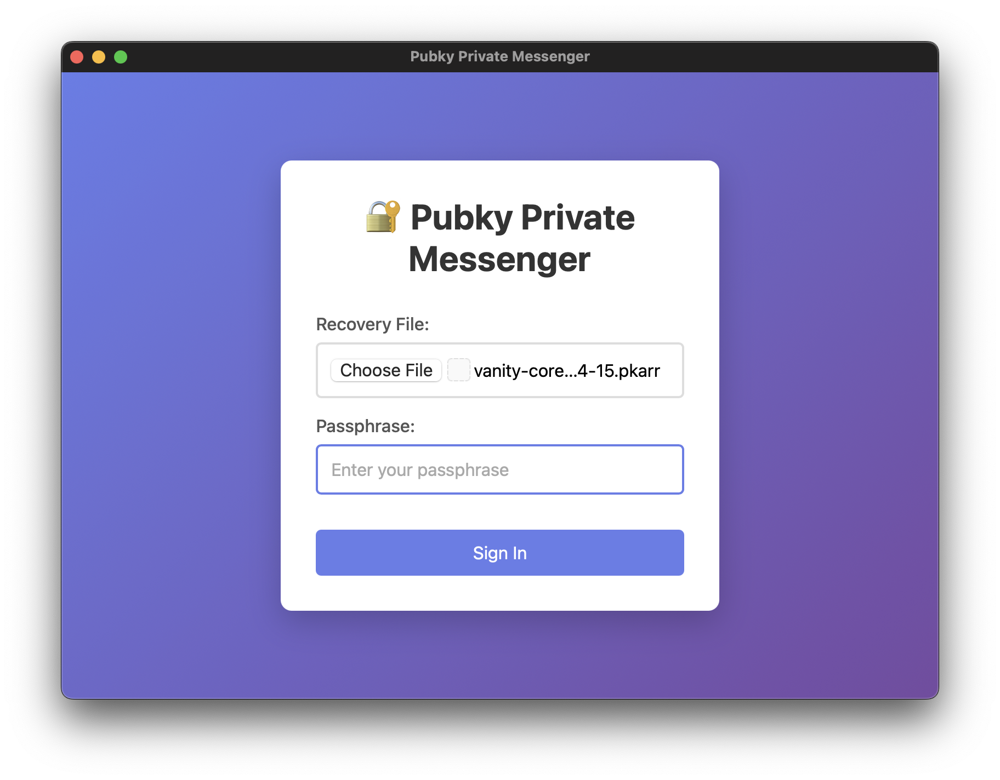
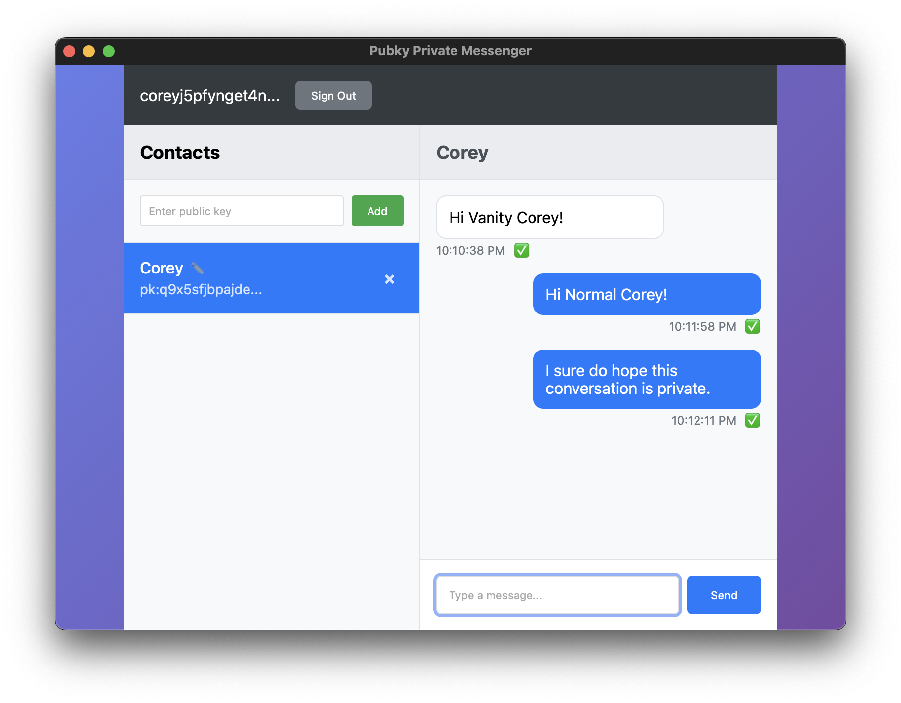

# 🔐 Pubky Private Messenger

An end-to-end encrypted messaging application built on the Pubky protocol.

## 📸 Screenshots

<div align="center">

### Login Screen


### Chat Interface


</div>

## ✨ Key Features

- **🔒 End-to-End Encryption** - Only conversation participants can read messages
- **🌐 Decentralized** - No central servers, each user controls their own data
- **🕵️ Metadata Privacy** - Even sender identities are encrypted
- **✅ Cryptographic Verification** - All messages are signed and verified
- **🏠 Self-Sovereign** - Your data, your homeserver, your control
- **📱 Cross-Platform** - Built with Tauri for native desktop performance

## 🏗️ How It Works

### Architecture Overview

1. **Decentralized Storage**: Messages stored as encrypted files on user homeservers
2. **ECDH Encryption**: Shared secrets derived from elliptic curve cryptography
3. **Public Discoverability**: Files are publicly accessible but cryptographically private
4. **Signed Messages**: All communications are cryptographically signed for authenticity

### Privacy Model

```
┌─────────────────┐    ┌─────────────────┐
│   Alice's       │    │    Bob's        │
│  Homeserver     │    │  Homeserver     │
├─────────────────┤    ├─────────────────┤
│ Encrypted Files │◄──►│ Encrypted Files │
│ Public Storage  │    │ Public Storage  │
└─────────────────┘    └─────────────────┘
         ▲                       ▲
         │                       │
    🔐 Decrypt                🔐 Decrypt
         │                       │
    ┌─────────┐              ┌─────────┐
    │  Alice  │◄────────────►│   Bob   │
    │(Private)│   Shared     │(Private)│
    │  Keys   │   Secret     │  Keys   │
    └─────────┘              └─────────┘
```

**What's Public**: File existence, timestamps, encrypted data blobs  
**What's Private**: Message content, sender identity, conversation relationships

## 🚀 Quick Start

### Prerequisites

- [Node.js](https://nodejs.org/) (v16 or later)
- [Rust](https://rustup.rs/) (latest stable)
- [Yarn](https://yarnpkg.com/) package manager

### Clone & Install

```bash
git clone git@github.com:coreyphillips/pubky-private-messenger.git
cd pubky-private-messenger
yarn add -D @tauri-apps/cli
yarn install
```

### Development

```bash
yarn tauri dev
```

### Build

```bash
yarn tauri build
```

## 📖 Usage Guide

### 1. Sign In


- **Recovery File**: Select your `.pkarr` recovery file (like `vanity-core...4-15.pkarr`)
- **Passphrase**: Enter your decryption passphrase
- Click **Sign In** to authenticate with your keypair

### 2. Add Contacts


- Copy a contact's public key (starts with their pubky address)
- Paste into the "Enter public key" field in the left sidebar
- Click **Add** to start a conversation

### 3. Send Messages

- Select a contact from the sidebar (they'll appear highlighted in blue)
- Type your message in the input field at the bottom
- Press **Enter** or click **Send**
- Messages are encrypted and stored on both homeservers
- ✅ Green checkmarks indicate verified messages

### 4. Manage Contacts

- **Edit Names**: Click the ✏️ icon next to any contact to set a custom name
- **Remove Contacts**: Click the × button to delete a contact
- **View History**: All messages are cached locally for quick access

## 🔧 Technical Details

### Encryption Scheme

```rust
// Shared secret generation (ECDH)
shared_secret = ECDH(sender_private_key, recipient_public_key)

// Message encryption
encrypted_content = encrypt(message_content, shared_secret)
encrypted_sender = encrypt(sender_pubkey, shared_secret)

// Digital signature
signature = sign(message_hash, sender_private_key)
```

### Storage Format

Messages are stored as JSON files on homeservers:

```json
{
  "timestamp": 1704067200,
  "encrypted_sender": [147, 23, 198, 45, ...],
  "encrypted_content": [78, 123, 56, 89, ...],
  "signature_bytes": [12, 34, 56, 78, ...]
}
```

### Privacy Guarantees

| Data Type | Visibility | Encryption |
|-----------|------------|------------|
| Message content | 🔒 Private | ✅ AES-256 |
| Sender identity | 🔒 Private | ✅ AES-256 |
| Timestamps | 👁️ Public | ❌ Metadata |
| File existence | 👁️ Public | ❌ Metadata |
| Conversation mapping | 🔒 Private | ✅ Path hashing |

## 🏛️ Architecture

### Components

- **Frontend**: Vanilla JavaScript + HTML/CSS
- **Backend**: Rust with Tauri framework
- **Networking**: Pubky protocol over HTTP
- **Cryptography**: Ed25519 + X25519 + AES-256
- **Storage**: Distributed homeserver network

### Data Flow

```
┌─────────────┐    ┌─────────────┐    ┌─────────────┐
│   Client    │    │    Tauri    │    │ Homeserver  │
│ (Frontend)  │◄──►│  (Backend)  │◄──►│ (Storage)   │
└─────────────┘    └─────────────┘    └─────────────┘
      │                    │                    │
   UI Logic          Crypto Logic         File Storage
   Caching           Key Management      Network Access
   Contacts          Message Signing     Public Discovery
```

## 🛡️ Security Features

### Cryptographic Properties

- **Forward Secrecy**: Each conversation uses unique shared secrets
- **Authentication**: Ed25519 signatures prevent impersonation
- **Integrity**: Message tampering is cryptographically detectable
- **Confidentiality**: AES-256 encryption protects content
- **Metadata Privacy**: Sender identities encrypted

### Threat Model

**Protected Against**:
- Mass surveillance and traffic analysis
- Homeserver operator snooping
- Network eavesdropping
- Message tampering
- Identity spoofing

**Not Protected Against**:
- Endpoint compromise (device theft)
- Coercion to reveal keys
- Traffic timing analysis
- Availability attacks on homeservers

## 🧪 Development

### Project Structure

```
pubky-private-messenger/
├── src/                    # Frontend (HTML/CSS/JS)
│   ├── index.html
│   ├── main.js
│   └── styles.css
├── src-tauri/             # Backend (Rust)
│   ├── src/
│   │   ├── main.rs
│   │   ├── lib.rs
│   │   ├── commands.rs    # Tauri commands
│   │   └── messaging.rs   # Core crypto logic
│   └── Cargo.toml
├── package.json
└── tauri.conf.json
```

### Debug Commands

Access debugging utilities in the browser console:

```javascript
// List all stored accounts
debugContacts.listAccounts()

// View current user's contacts  
debugContacts.currentContacts()

// Check message caches
debugContacts.messageCaches()

// Clear specific account data
debugContacts.clearAccount(pubkey)
```

### Building from Source

```bash
# Install Rust dependencies
cd src-tauri
cargo build

# Install Node dependencies  
cd ..
yarn install

# Run in development mode
yarn tauri dev

# Create production build
yarn tauri build
```

## 🤝 Contributing

We welcome contributions! Please read our contributing guidelines:

1. **Fork** the repository
2. **Create** a feature branch (`git checkout -b feature/amazing-feature`)
3. **Commit** your changes (`git commit -m 'Add amazing feature'`)
4. **Push** to the branch (`git push origin feature/amazing-feature`)
5. **Open** a Pull Request

### Development Setup

```bash
# Clone your fork
git clone https://github.com/yourusername/pubky-private-messenger.git
cd pubky-private-messenger

# Install dependencies
yarn install
cd src-tauri && cargo build && cd ..

# Run tests
cargo test
yarn test

# Start development server
yarn tauri dev
```

## 📄 License

This project is licensed under the MIT License - see the [LICENSE](LICENSE) file for details.

## 🔗 Links

- **Pubky Protocol**: [https://pubky.org](https://pubky.org)
- **Documentation**: [Coming Soon]
- **Bug Reports**: [GitHub Issues](https://github.com/coreyphillips/pubky-private-messenger/issues)
- **Discussions**: [GitHub Discussions](https://github.com/coreyphillips/pubky-private-messenger/discussions)

## ⚠️ Disclaimer

This software is experimental and under active development. This software has not undergone formal security auditing. Use at your own risk for sensitive communications.

---